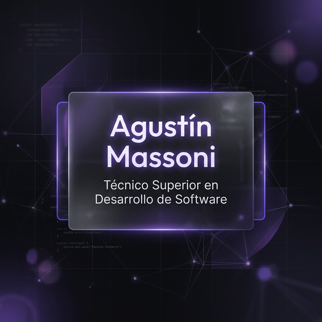

# Agustín Massoni | Software Engineer Portfolio 🚀

<p align="center">
  
</p>

Bienvenido a mi repositorio principal. Este sitio no es solo un portfolio, es una demostración de ingeniería de software moderna, centrada en el rendimiento, la seguridad y una experiencia de usuario excepcional.

---

## 🛠️ Stack Tecnológico & Decisiones

Mi elección de herramientas se basa en la búsqueda del equilibrio perfecto entre **rendimiento nativo**, **mantenibilidad** y **experiencia de usuario**.

| Categoría | Tecnologías | ¿Por qué esta herramienta? |
|-----------|-------------|----------------------------|
| **Framework** | **Nuxt 4 / Vue 3** | Elegido por su sistema de renderizado híbrido (SSR/SSG), reactividad eficiente y una arquitectura modular que facilita el escalado. |
| **Estilos** | **Vanilla CSS & CSS Variables** | Prioricé CSS puro para evitar la sobrecarga de frameworks externos y tener control total sobre el diseño, aprovechando variables para un sistema de diseño consistente. |
| **Seguridad** | **Nuxt Security** | Implementación de cabeceras de seguridad de nivel industrial (CSP, HSTS) directamente en el ciclo de vida del framework. |
| **Imágenes** | **@nuxt/image** | Optimización automática a WebP y compresión dinámica para maximizar el Core Web Vitals y la velocidad de carga. |
| **SEO** | **@nuxtjs/seo** | Automatización de metadatos térmicos y datos estructurados (JSON-LD) para una indexación impecable. |
| **Animaciones**| **Animate.css & CSS Transitions** | Enfoque en micro-interacciones ligeras que mejoran la UX sin comprometer el rendimiento del hilo principal. |
| **Herramientas**| **Vite / TypeScript** | Un entorno de desarrollo ultra-rápido y tipado estático para minimizar errores en tiempo de ejecución. |

---

## 🔥 Características Destacadas

### 🏗️ Arquitectura de Vanguardia

- **Nuxt 4 + Vue 3 (Composition API)**: Aprovechando las últimas innovaciones del framework para un renderizado híbrido ultra rápido.
- **Glassmorphism Design**: Interfaz moderna y premium con micro-animaciones fluidas (Animate.css).
- **Responsive Design**: Navegación móvil de élite con sidebar animado y UX adaptada.

### 🛡️ Hardening y Seguridad

- **Nuxt Security**: Configuración de cabeceras HTTP estrictas (CSP, HSTS, X-Frame-Options).
- **Anti-Spam (Honeypot)**: Formulario de contacto protegido contra bots sin sacrificar la UX del usuario.
- **Validación Robusta**: Manejo de estados de carga y errores inmersivos (404 temática Dark Souls).

### ⚡ Optimización y SEO

- **Imágenes Next-Gen**: Conversión automática a **WebP** mediante `@nuxt/image`.
- **SEO Semántico**: Datos estructurados **JSON-LD (Schema.org)** para visibilidad máxima en buscadores.
- **Open Graph Ready**: Metadatos optimizados para una presencia impecable en LinkedIn y otras redes sociales.

---

## 🛠️ Stack Tecnológico

| Categoría        | Tecnologías                                         |
| ---------------- | --------------------------------------------------- |
| **Frontend**     | Nuxt 4, Vue 3, TypeScript, CSS3                     |
| **Styling**      | Vanilla CSS (Variables), Animate.css                |
| **Módulos**      | @nuxt/image, @nuxtjs/seo, nuxt-security, @nuxt/icon |
| **Herramientas** | Vite, Prettier, Git, Formspree                      |

---

## 🚀 Instalación y Desarrollo

Si deseas explorar el código localmente, sigue estos pasos:

1. **Clonar el repositorio**:

   ```bash
   git clone https://github.com/Wolfbiert/portfolio.git
   ```

2. **Instalar dependencias**:

   ```bash
   npm install
   ```

3. **Iniciar el servidor de desarrollo**:

   ```bash
   npm run dev
   ```

4. **Acceder localmente**:
   Abre [http://localhost:3000](http://localhost:3000) en tu navegador.

---

## 📸 Easter Eggs

- Intenta acceder a una ruta inexistente para ver la página de error personalizada: `Hoguera de Descanso`.

---

## 📬 Contacto

¿Tienes un proyecto en mente o te gustaría charlar sobre tecnología?

- **LinkedIn**: [Agustín Massoni](https://www.linkedin.com/in/agustin-massoni)
- **Email**: agustinmassoni10@gmail.com
- **WhatsApp**: [Contactar conmigo](https://wa.me/tu-numero-aqui)

---

## ⚖️ Licencia

Este proyecto está bajo la [Licencia MIT](LICENSE). Siéntete libre de navegar y aprender del código.

---

_Desarrollado con ❤️ y mucha cafeína por Agustín Massoni._
